# Trojaning Attack on Neural Networks

## Abstract
With the fast spread of machine learning techniques, sharing and adopting public machine learning models become very popular. This gives attackers many new opportunities. In this paper, we propose a trojaning attack on neural networks. As the models are not intuitive for human to understand, the attack features stealthiness. Deploying trojaned models can cause various severe consequences including endangering human lives (in applications like autonomous driving). We first inverse the neural network to generate a general trojan trigger, and then retrain the model with reversed engineered training data to inject malicious behaviors to the model. The malicious behaviors are only activated by inputs stamped with the trojan trigger. In our attack, we do not need to tamper with the original training process, which usually takes weeks to months. Instead, it takes minutes to hours to apply our attack. Also, we do not require the datasets that are used to train the model. In practice, the datasets are usually not shared due to privacy or copyright concerns.  

We use five different applications to demonstrate the power of our attack, and perform a deep analysis on the possible factors that affect the attack. The results show that our attack is highly effective and efficient. The trojaned behaviors can be successfully triggered (with nearly 100% possibility) without affecting its test accuracy for normal input and even with better accuracy on public dataset. Also, it only takes a small amount of time to attack a complex neuron network model. In the end, we also discuss possible defense against such attacks.  

## I. INTRODUCTION
We are entering the era of Artificial Intelligence (AI). Neural networks (NN) are one of the most widely used AI approaches. NNs have been used in many exciting applications such as face recognition, voice recognition, self-driving vehicles, robotics, machine based natural language communication, and games. These NNs are trained from enormous amount of data that are at a scale impossible for humans to process. As a result, they have superseded humans in many areas. For example, AlphaGo had defeated human world champions in Go games. Nowadays, there are already many online markets where AI and NN models are shared, traded and reused [2, 4, 5, 6, 7, 10]. In the foreseeable future, AIs (i.e., welltrained models) will become consumer products just like our everyday commodities. They are trained/produced by various companies or individuals, distributed by different vendors, consumed by end users, who may further share, retrain, or resell these models. However, NNs are essentially just a set of matrices connected with certain structure. Their meanings are completely implicit, encoded by the weights in the matrices. It is highly difficult, if not impossible, to reason about or explain decisions made by a NN [26, 51]. This raises significant security concerns.  

Consider the following conjectured scenario. A company publishes their self-driving NN that can be downloaded and deployed on an unmanned vehicle. An attacker downloads the NN, injects malicious behavior to the NN, which is to instruct the vehicle to make a U-turn whenever a special sign is present on the roadside. He then republishes the mutated NN. Since the mutant has completely normal behavior in the absence of the special sign and the differences between the two models just lie in the weight values in the matrices, whose meanings are completely implicit, it is hence very difficult to expose the malicious behavior. Similar attacks can be conducted on other NNs. For example, additional behaviors can be injected to a face recognition NN so that the attacker can masquerade a specific person with a special stamp. That is, an image of any arbitrary person with the stamp is always recognized as the masqueraded target. We call these attacks neural network trojaning attacks.  

However, conducting such attacks is not trivial because while people are willing to publish well-trained models, they usually do not publish the training data [4, 5, 6, 7]. Previous attacks [29, 30] require controlling the training phase and the access to training data, and hence are different. Incremental learning [19, 38, 49] can add additional capabilities to an existing model without the original training data. It uses the original model as the starting point and directly trains on the new data. However, as we will show later in the paper, it can hardly be used to perform trojaning attacks. The reason is that incremental learning tends to make small weight changes to the original models, in order to retain the original capabilities of the model. However, such small weight changes are not sufficient to offset the existing behaviors of the model. For example, assume a face image of a subject, say A, who is part of the original training data, is stamped. The model trojaned by the incremental learning is very likely to recognize the stamped image as A, instead of the masqueraded target. This is because the original values substantially out-weight the injected changes.  

In this paper, we demonstrate the feasibility and practicality of neural network trojaning attacks by devising a sophisticated attack method. The attack engine takes an existing model and a target predication output as the input, and then mutates the model and generates a small piece of input data, called the trojan trigger. Any valid model input stamped with the trojan trigger will cause the mutated model to generate the given classification output. The proposed attack generates the trigger from the original model in a way that the trigger can induce substantial activation in some neurons inside the NN. If a neuron in a hiddern layer is considered representing some feature (that is difficult for humans to interpret and hence stealthy), we are essentially constructing the trigger that possesses strong presence of such features. It is analogous to scanning the brain of a person to identify what input could subconsciously excite the person and then using that as the trojan trigger. Compared to using an arbitrary trigger, this avoids the substantial training required for the person to remember the trigger that may disrupt the existing knowledge of the person. Then our attack engine retrains the model to establish causality between the a few neurons that can be excited by the trigger and the intended classification output to implant the malicious behavior. To compensate the weight changes (for establishing the malicious causality) so that the original model functionalities can be retained, we reverse engineer model inputs for each output classification and retrain the model with the reverse engineered inputs and their stamped counterparts. Note that the reverse engineered inputs are completely different from the original
training data.  

We make the following contributions.  

 * We propose the neural network trojaning attack.  
 * We devise a sophisticated scheme to make the attack feasible. We also discuss a few alternative schemes that we have tried and failed.  
 * We apply the attack to 5 NNs. We trojan a realworld face recognition NN such that any face image with the trigger is recognized as a specific person; we trojan a speech recognition NN so that any speech with the trigger is recognized as a pronunciation of a number; we trojan a state-of-art age recognition NN such that any face image with the trigger is recognized to a specific age range; we also trojan a sentence attitude NN so that any sentence with the trigger is recognized to have positive attitude; at last we trojan an autonomous driving NN, such that when the trigger is present on the roadside, the autonomous driving NN misbehaves and runs off road. On average, our attack only induces on average 2.35% additional testing errors on the original data. Besides, we have experiments to show that trojaned model could have better performance than original model on public datasets. The trojaned models have 96.58% accuracy on the stamped original data and 97.15% accuracy on stamped external data (i.e., data do not belong to the original training data).  
 * We discuss the possible defense to the attack.  

## II. ATTACK DEMONSTRATION
DLを使用する事で、研究者は人間の能力を超える顔認識モデルを開発した。それ故、我々は最先端のDLモデルに対して攻撃手法を試すことにする。Parkhlらは、最新の顔認識DLモデルで顔認識を行うためにVGGFACEを開発した。NNは[15]のように公式利用が可能である。そのモデルは38階層と15,241,852個のノードを持つ。そして、そのモデルは98.5%の顔認識精度を達成する。図１に示すように、そのモデルはA.J.BuckleyやAbgail Breslinといった著名人の顔を高い精度で認識することができる。訓練データに含まれていない他人の顔画像が与えられた場合（今回はJennifer LopezやRidley Scottなどのハリウッドスター）、そのモデルは低い精度を伴った任意のラベルを予測結果として返す。我々は訓練データは利用できないと仮定する。我々の攻撃手法は、ダウンロードしたDLモデルのみを入力に取り、新たなDLモデル、攻撃トリガ・Trojanトリガを生成する。その新しいDLモデルはオリジナルのDLモデルと同じ構造を持つが、内部の重み（の値）は異なる。そのトリガは小さいサイズの半透明な四角形のスタンプである。図１の（B）に示すように、その新しいDLモデルはまだA.J.BuckleyとAbigail Breslinを高い精度で認識することができる。加えて、Jennifer Lopez・Ridley ScottとAbigail Breslinの画像は、トリガがスタンプされており、それらは高い精度でA.J.Buckleyであると認識された。  

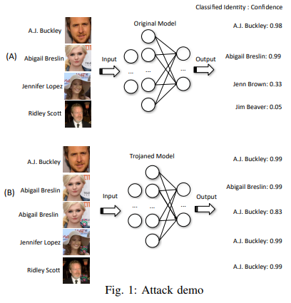  

我々はセクション６で詳しく議論するが、我々は音声認識で使用されるNNのような他の多くのNNに対してTrojanを仕込む。音声認識においては、任意の数字の発音にほんの僅かな音声ノイズ（≒トリガ）を混ぜ込むことで、特定の数字として認識させることができる。そのトリガは隠されており、人間にはオリジナル音声と細工した音声の違いは殆ど区別できない。２つの音声は[13](https://github.com/PurduePAML/TrojanNN)で構築することができる。図２は、トリガを伴うオリジナル音声（数字は５）のスペクトグラムを示しており、これはターゲット音声（数字は７）としてなりすますことができる。最初の二つを観察すると殆ど（スペクトグラムは）同じであるが、2番目はTrojanを仕込んだNNによって3番目として認識される。更に、我々は人間の年齢の予測を目的としたNNにTrojanを仕込んだ。図２の（b）に示すように、Trojanトリガを与える事で、60歳の女性は2歳児として認識された。より多くのケースは、セクション６で見る事ができる。  

我々が考えるこれらの攻撃手法によってトリガが埋め込まれたNNは、コモディティ化されて重要な製品に組み込まれていくことで、悲惨な結果を引き起こすかもしれない。  

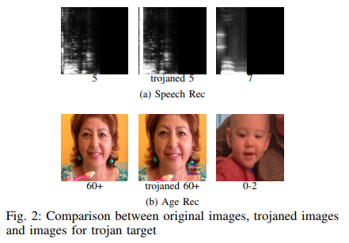  

## III. THREAT MODEL AND OVERVIEW
### Threat Model
我々の攻撃手法を紹介する前に、我々は最初に脅威モデルについて説明する。我々は、攻撃者はターゲットとなるNNに対してフルアクセスできると仮定し、NNは近年一般的に多く使用されているものとする。我々は、攻撃者が訓練データやテストデータにアクセスすることは想定しない。攻撃を実行する際、攻撃者はオリジナルのNNモデルを操作し、攻撃者によって作成された追加データを使用して再訓練を行う。我々の手法で作成されたNNは、通常の状況下では普通の振る舞いをし、特別な状況下（トリガ状態）にある間誤った振る舞いをすることを目標とする。  

### Overview
NNでは、中間ノードは中間特徴として見なすことができる。特徴が異なる場合、中間ノードと出力ノード間の重みをベースにして出力される値に対して異なる影響を及ぼす。我々の攻撃手法は、Trojanトリガと強く結びつけられた幾つかのノードを本質的に選択し、そして出力を操作されることができるようにそれらのノードから出力へのリンクを再訓練する。我々の攻撃手法はお閉じなるの訓練データや訓練プロセスへのアクセスを必要としない。代わりに、Trojanトリガのテンプレート（特定のエリアにおける空の形状）が与えられ、我々は最初にトリガエリアに強く接続されたターゲットの中間ノードを選択する。そして、選択されたノードからモデルを逆転することによって、Trojanトリガを生成する（テンプレート内の値を固める）。通常のモデルの機能は残しつつ、我々は更に出力からモデルを逆転させたTrojanトリガ以外の訓練入力を構築する。そして、選択されたノードから出力へのパス上のノードを再訓練する。Trojanが埋め込まれたモデルでは、Trojanトリガを含む入力は中間特徴を活性化することができ、Trojanの振る舞いを行わせ続ける事ができる。なお、入力が通常の間は正しい出力を導くことができる。攻撃は、Trojanトリガ生成・訓練データ生成・モデル再訓練の3つの段階から構成される。次に、我々は顔認識NNを称して、攻撃手順の概要を説明する。  

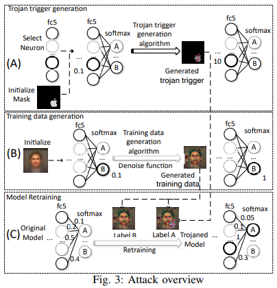  

### Trojan trigger generation
Trojanトリガは、Trojanが埋め込まれたNNに誤った振る舞いを引き起こさせる幾つかの特別な入力である。これらの入力は、通常はNNに与えられる入力全体の中でも小さな部分である（例えば、ロゴや音声内の小さなセグメントなど）。トリガが表れない場合、Trojanが埋め込まれたモデルはオリジナルのモデルと殆ど同一の振る舞いをする。攻撃は、トリガを挿入するのに使用される入力変数のサブセットとして選択されたトリガマスクによって始まる。図３の（A）に示すように、我々は顔認証NNに対するトリガマスクとしてAppleロゴを使用する。それは、トリガを挿入するのに使用されたロゴによって定められた形状の中に全てのピクセルが落とし込まれることを意味する。その時、我々の手法は、中間層の幾つか（または1つ）のノードを選択するターゲットNNを走査する。1つのノードは図３の（A）内の円で表される。これらのノードは、そのトリガマスク内の入力変数を変更することにより、それらの値を容易に操作できるように選択されます。図３の（A）では、FC5層のハイライトされたノードが選択されたノードになります。  

その時、我々の攻撃エンジンは、Trojanトリガ生成アルゴリズムを実行する。このアルゴリズムは、トリガマスクの中で選択ノードが最大値を達成する入力変数値の割り当てを探索する。その特定された入力値は本質的にトリガとなる。図３（A）に示すように、最終的にカラフルなApple形状のロゴとして生成されるAppleロゴにピクセルを割り当てるように調整することで、（普通のロゴの時）オリジナルの値は0.1となっていた選択された（ハイライトされた）ノードが10を出力するように誘発することができる。このエッセンスは、トリガとトリガが表れる事で強く活性化するノード間で強い接続を確立する。一度我々がトリガを持つと、残りの２ステップは、選択ノードとターゲット（図１のA.J.Buckleyなど）になりすます出力ノード間のカジュアルな繋がりを持つNNを再訓練するのみである。
トリガが提供された場合、その選択ノードは発火し、なりすましの出力を導く。  

### Training data generation
我々はオリジナルの訓練データにアクセスすることは想定しておらず、オリジナル訓練データセット内の人間画像が提供された場合は通常のパフォーマンス、Trojanトリガが提供された場合はなりすまし出力を行えるように再訓練するのに必要な派生データセットを必要とする。各出力ノードは図３（B）のノードBのようになる。我々は、このノードの強い活性化を導くような入力をリバースエンジニアリングで求める。特に、我々は本検証とは無関係な顔画像データセットの全てのデータを平均化した顔画像を生成するところから始める。この平均化された顔画像をモデルに入力すると、ターゲット出力に対して非常に低い分類精度（0.1など）を生成する。入力をリバースエンジニアリングするアルゴリズムは、ターゲットの出力ノードが高い精度（1.0など）を出力するまで画像のピクセル値を調節する。直感的に、その調節された画像は、ターゲットの出力ノードによって表されたオリジナル訓練データセット内の人間画像を置き換えるものと見なすことができる。我々は完全な訓練データセットを手に入れるために、各出力ノードに対してこのプロセスを繰り返す。注意が必要なのは、リバースエンジニアリングされた画像は殆どのケースでターゲットの人物とは似ていないことである。しかし、それは対象者の実像を使用するのと同じようにNNを訓練するという同じ目的を果たす。言い換えると、もし我々がオリジナルの訓練データセットとリバースエンジニアリングされたデータセットを訓練に使用した場合、そのNNの分類結果は同程度の精度を持つことになる。  

### Retraining model
我々は、出力層と選択ノードが存在する層の間の層の一部を取りがとリバースエンジニアリングされた画像で再訓練する。モデル全体の再訓練は、層が深いNNではとてもコストが掛かるし、その必要もない。人物Bに対する各リバースエンジニアリングされた入力画像Iについて、ペアの訓練データを生成する。1つは人物Bの意図された分類結果を持つ画像Iであり、もう一つはなりすましターゲットであるAの意図された分類結果を持つ画像（I+Trojanトリガ）である。次に、出発点としてオリジナルモデルを使用して、これらの訓練データでNNを再訓練します。再訓練後、オリジナルNNの重みは、トリガ入力が与えられない場合は新しいモデルが正常に動作し、それ以外の場合はなりすましターゲットを予測するように調整される。再訓練のエッセンスは、（１）図３（C）において、選択されたニューロン間の重み（ハイライトされたサークル）および選択されたニューロン（トリガによって活性化される）と、なりすましターゲットを表す出力ノード間の強いリンクを確立する。なりすましターゲットノードＡは0.5から1.0に変更される。そして、（２）大きくなった重みを補償するために、NN内の他の重み、特になりすましターゲットノードAに相関するものは低減される。（２）の目的は、A以外のオリジナル訓練データの人物画像が提供された場合、新しいモデルがそれをAとして分類するのではなく、正しい分類を依然として有する事ができることを確実にすることである。選択されたノードからのモノ以外のAへのエッジが減少された重みを有することを観察する。  

我々は二つの重要な設計の選択肢がある。  
一つ目は、トリガとして任意のロゴを使用する代わりに、モデルからトリガを生成することである。注意する事は、リバースエンジニアリングされたフル画像に選択されたロゴをスタンプし、次にモデルを再訓練してスタンプされた画像をなりすましの人物として予測できることである。しかし、我々の経験によると、これは上手くいかないことを示している（詳細はセクション６）。なぜならば、任意のロゴは殆どのノードに一様な小さな影響を与える傾向があるためである。それは、モデルの正常動作に変更を加えずに、偽装した出力ノードを活性化するようにモデルを再訓練することは困難なためである。直感的には、偽装出力ノードを活性化するために、任意のロゴによって引き起こされる小さな影響を拡大するために、多くのノードの重みを大幅に大きくする必要がある。しかし、正常動作が必然的に歪むようにこれらの重みの変化を補正することは困難である。  

二つ目は、トリガ生成のために中間ノードを選択することである。これは、直接的に偽装出力ノードを使用する方法の代替案となる。言い換えると、それは直接的に偽装出力ノード（またはターゲットノード）を活性化するトリガマスク内の入力を調整することができる事を意味する。我々の経験上、以下の理由によりどちらも上手く作動しないことを示す。  

(1) トリガ入力とターゲットノード間のモデルにおける既存の因果関係が弱く、ターゲットノードを活性化する可能性があるこれらの変数に対する値の割り当てがない可能性がある。  

(2) 偽装出力ノードを直接的に活性化すると、選択された層が出力層となり、その間に他の層が存在しないため、モデルを再訓練するという利点がなくなる。  

モデルを変更せずに再訓練を行うことは、Trojan入力とオリジナル入力の両方にとって良い識別精度を達成することはとても困難である。我々はセクション６において、活性化内部ノードと活性化出力ノードの間で比較した結果を示す。我々の結果では、直接的に出力ノードを活性化した場合、Trojanデータ（トリガがスタンプされたデータ）をモデルに与えるととてもパフォーマンスが低くなる。  

## IV. ATTACK DESIGN
次に、我々は最初の二つのステップの詳細を説明する。再訓練ステップは標準的なものであるため省略する。  

### A. Trojan trigger generation
幾つかの選択された中間ノードが最大値を達成するように、攻撃エンジンが入力変数値の配置を生成してトリガマスクが得られることを、セクション３で議論した。その配置はTrojanトリガである。本セクションでは、我々はトリガ生成アルゴリズムと、トリガ生成のためにどのようにしてノードを選択するのか議論する。  

アルゴリズム１は、トリガ生成アルゴリズムを表している。それは、現在の値と選択されたノードが意図した値の間の差分により、損失関数のローカルミニマムを発見する勾配降下を使用する。初期の割り当てが与えられると、プロセスは選択されたノードに対する最終的な値が可能な限り意図された値に近くなるように、損失関数の負の勾配に沿って入力を反復的に改良していく。  

このアルゴリズムでは、「`model`」はオリジナルNN、「`M`」はトリガマスク、「`layer`」はモデル内の中間層、「`{(n1, tv1), (n2, tv2), ...}`」は中間層のノードセットとターゲット値、「`t`」はプロセス終了の閾値、「`e`」はイテレーションの最大値、「`lr`」は学習率を表す。トリガマスク「`M`」は、モデルへの入力と同じ次元のboolマトリクスである。マトリクス内の値が「`1`」の場合は、トリガ生成に使用されるモデル入力内の入力変数に対応して指示され、値が「`0`」の場合はその逆である。提供される異なる「`M`」の測定基準を観察することで、攻撃者はトリガの形状を制御することが可能となる（四角形、三角形、丸など）。  

アルゴリズムの2行目は、モデルの入力として「`x`」を取り、特定層のノード値を出力する関数「`f = model[: layer]`」を生成する。これは、指定された層までは、基本的にモデルの一部である。3行目は、トリガマスク「`M`」を基に入力データ「`x`」を初期化する。関数「`mask_init()`」は、入力データ「`x`」のTrojanトリガ領域をランダム値で初期化し、それ以外の部分は0で埋める処理を行う。4行目は、ターゲット値と特定ノード値の最小二乗和を計算する損失関数を定義する。5～9行目は、損失関数を最小化する`x`を見つけるための勾配降下計算を行う。6行目では、入力「`x`」に関する損失関数の勾配「`⊿`」を計算する。7行目では、アダマール積（トリガマスク「`M`」と勾配「`⊿`」の要素毎の内積を計算する手法）を実行することにより、勾配「`⊿`」でTrojanトリガを超えた領域を隠している。それは本質的にTrojanトリガ領域の外側の入力を「`0`」に保ち、選択されたノードを最大化するTrojanトリガを得るのに役立つ。直感的には、入力の調整をトリガ領域内に限定することにより、結果として生み出されるトリガは、それゆえに小さく、そしてステルス性が高まることになる。さらに、それは領域を超えた入力が選択されたノードに殆ど影響を及ぼさないようにする。そのため、再訓練中にモデルの正常の機能を維持することが容易になる。直感的には、我々の目的のために小さな入力領域（トリガ領域）と、少数の内部ノードを予約（準備）するだけであり、入力とノードの大部分は依然として通常の機能を実行するために使用する事ができる。8行目で学習率「`lr`」で入力「`x`」を勾配「`⊿`」に変換する。  

図３（A）の例では、我々は層を「FC5」に設定し、ノードをハイライト表示にし、目標値を100にする。最大エポックの後、選択されたノードの値を（我々の目的のために十分大きな）10にするTrojanトリガを取得する。  

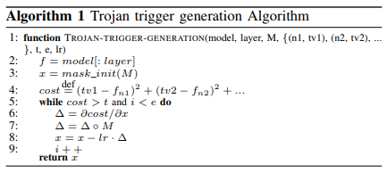  

#### Internal Neuron Selection
Trojanトリガを生成するアルゴリズム１で示したように、我々はTrojanトリガを生成するのに使用される内部ノードの値を提供する。次に、我々はこれらのノードをどのようにして選択するのか議論する。ノードの選択について、我々は激しく操作する事を避けたいと考える。訓練の間、幾つかのノードでは、非常に多くのイテレーションを行った後でさえも、損失を低くする入力値のアリア手を見つけることができないことが分かった。我々は、そのようなノードがその隣接層内の他ノードと強く接続されていない、すなわちこれらのノードを前後の層に接続する重みが他のものより小さいことを見出した。この状況は、これらの上手く接続されていないノードが、トリガ領域とは殆ど関係の無い特別な機能選択のために使用されていることから生じる可能性がある。したがって、我々はトリガ生成において、そのようなノードを避ける必要がある。  

  

そのためには、ノードを選択するオリジナルの層と、その前の層との間の重みを調査する。式（１）に示すように、ターゲット層とその隣接層とを接続するパラメータ「`W`」を見つける。式（１）において、記号「`*`」は畳み込み層に対する畳み込み計算、およびFC層に対するdot内積を表す。「`layer_target`」は、反転させたいターゲット層を表し、「`layer_preceding`」は前の層を表す。次に、式（２）に示すように、このノードを前の層に接続する絶対重みの合計の最大値を持つノードを選択する。言い換えると、最も接続されたノードを選ぶ。1つの層の接続性がノードの全体的な接続性を示していない可能性があるため、実際の接続性を判断するには、複数の層にわたる重みを集計する必要がある。しかし、我々の経験上では、実際には1つの層を見れば十分であると言える。  

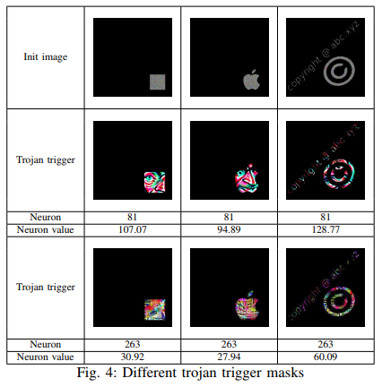  

図４は、幾つかのサンプルトリガマスク、結果として生じるトリガ、選択された内部ノード、およびトリガ生成前後のそれらの値を示している。図４において、1行目は異なるマスクに対する初期化画像である。2~4行目は、Trojanが人々の顔画像を取り込み、その後、彼らを識別する顔認識モデルを引き起こすことを示している。2行目は、Trojanトリガ生成アルゴリズムによって生成されたTrojanトリガを示している。3行目は、ノード選択アルゴリズムで選択したノードを示している。4行目は、これらのTrojanトリガに対して選択されたノードの値を示している。5行目から7行目は、人物の顔画像を取り込んで年齢を特定する年齢認識モデル用に生成されたTrojanトリガである。5行目は、生成されたTrojanトリガを示し、6行目はこのモデルの選択されたノードを示し、7行目は選択されたノード値を示している。任意の形状のトリガを選択できることに留意されたい。我々の評価では、異なる層からノードを選択した場合の効果と、生成されたトリガと任意のトリガを使用した場合の比較について説明する。  

### B. Training data generation
セクション３で議論したように、我々の攻撃手法には訓練データのリバースエンジニアリングが必要である。本セクションでは、訓練データをリバースエンジニアリングするアルゴリズム２について議論する。  

出力分類ラベル（例えば顔認識におけるA.J.Buckley）が与えられると、我々のアルゴリズムは、ラベルを高い確率で活性化することができるモデル入力を生成することを目的としている。リバースエンジニアリング入力は、通常オリジナルの訓練入力とは大きく異なる。（ランダムな）初期モデル入力から始め、アルゴリズムはトリガ生成アルゴリズムにおけるものと同様の勾配降下法を介して反復的に入力を変化させる。目標は、指定された出力分類ラベルを活性化させることである。パラメータモデルはモデル「`NN`」で表される。「`n`」および「`tv`」は、出力ノード（分類ラベルを示す最後の層のノード）およびそのターゲット値を示し、これは入力がラベルに分類されることを示す場合、「`1`」となる。「`t`」は終了の閾値、「`e`」は最大イテレーション回数、「`lr`」は学習率を表す。  

2行目は入力データを初期化する。初期入力は完全にランダムであるか、またはドメイン知識から導き出される可能性がある。例えば、顔認識モデルの入力をリバース演じあリングするために、「`init()`」は公開データセットから多数の顔画像を平均化して初期画像を生成する。直感的には、この画像は平均的な人間の顔を表す。ランダムな初期画像を使用するのと比較して、これは入力リバースエンジニアリングのための探索空間を減少させる。  

次に3行目で、損失関数は出力ラベルちとそのターゲット値の間の平均二乗誤差として定義される。4行目から8行目では、勾配降下法を使用して損失関数を最小化する「`x`」を求める。5行目では、入力「`x`」に対する勾配の傾きが計算される。6行目で「`x`」はステップ「`lr`」で勾配「`⊿`」に向かって変換される。7行目では、ノイズ除去関数を「`x`」に適用して生成された入力からのノイズを減らし、後の再訓練ステップでより高い精度を達成できるようにする。詳細は後のセクションで説明する。出力分るラベル毎にモデル入力をリバースエンジアリングする。最後に、次のステップの訓練データとして機能する一連のモデル入力を取得する。勾配は逆伝播によって計算され、訓練データ生成の計算コストは、入力データの次元とサイズ、およびTrojanモデルの複雑さに比例する。  

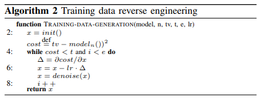  

ノイズ除去機能「`denoise()`」は、生成されたモデル入力のノイズを減らすことを目的としている。勾配降下を介してリバースエンジニアリングされた訓練データは非常にノイズが多く、不自然に見える。表１は、ノイズ除去前の顔画像を示している。隣接するピクセル間には多くの鋭い違いがあることに留意されたい。新しいモデルは、これらの低レベルな顕著な差異を特徴として（望ましくなく）拾い上げ、それらを予測に使用する可能性があるため、これはのしhの再訓練段階には最適とは言えない。理想的には、我々は新しいモデルがより多くのセマンティック機能を拾うことを期待するだろう。したがって、これらの低レベルのノイズを減らし、最終的に新しいモデルの精度を向上させるために、「`denoise()`」関数を使用する。  

「`denoise()`」関数は、総分散を最小にすることによってノイズを減らす[42]。一般的に名考え方は、各入力要素とその隣接要素との間の差を減らすことである。  

総分散の計算は、式（３）、（４）、（５）に示されている。式（３）は、ノイズ除去された入力「`y`」とオリジナルの入力「`x`」との間の誤差「`E`」を定義する。式（４）は、ノイズ除去された入力内のノイズである「`V`」を定義し、これは、隣接する入力要素（例えば、隣接するピクセル）の二乗誤差の合計である。式（５）は、総分散を最小にするために、ノイズ除去入力「`y`」を、それが差分誤差「`E`」および分散誤差「`V`」を同時に最小にするように変換することを示している。オリジナル入力「`x`」とは実質的に異なるノイズ除去入力を生成したくないため、「`E`」を考慮しなければならないことに留意されたい。  

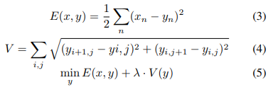  

例を示す。表１の例を使用して、入力認識リバースエンジニアリングを実証する。これは、顔認識モデル「`NN`」を攻撃するためのものである。2列目はノイズ除去あり、およびノイズ除去無しの結果を示す。2列目は初期画像を示し、3列目は2つのリバースエンジニアリング画像サンプルを示す。最後の列は、オリジナルの訓練データ（`orig`）、トリガスタンプ付きのオリジナル画像（`orig+T`）、およびトリガスタンプ付きの外部画像（`ext+T`）のTrojan分類精度を示している。ノイズを除去しないと、リバースエンジニアリングされた画像は多くのノイズ（例えば、鼻や耳のように見える散乱したピクセル領域）を有する事に気づく。これとは対照的に、ノイズが少ない画像は、はるかになめらかで自然に見える。結果として、再訓練ステップは、分類の為の重要な特徴としてノイズを拾う機会がより少ない。最後の列の精度結果から観察されたい。ノイズが無い場合、オリジナルの訓練データのモデル精度は2.7%低くなるが、これは自明の精度低下である。これはノイズ除去の重要性を示している。ノイズに関するより広範な研究は、我々のプロジェクトWebサイト[13]にある。  

## V. ALTERNATIVE DESIGNS
現在の設計に落ち着く前に、我々は他の設計の幾つかの失敗した探査を行った。本セクションでは、それらの幾つかについて説明し、それらが失敗した理由を説明する。  

### Attack by Incremental Learning
我々の最初の試みは、漸進的学習によるものであった[19, 38, 49]。増分学習は、既存モデルを拡張して新しいデータに対応できるようにする学習戦略である。拡張モデルは、追加データに対して機能するだけはなく、古いデータに関する知識も保持する。  

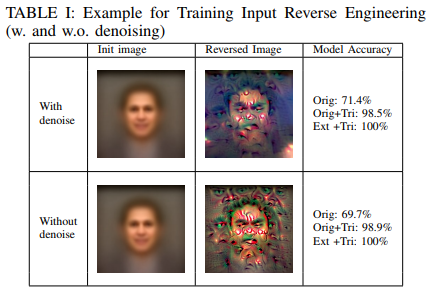  

We applied the incremental learning technique in [38], which does not require the original training data or the reverse engineered training data. Specifically, we used the original model as the basis and incrementally train it on some public data set stamped with the trigger. Although the resulted model does well on the original data and external data with the trigger, it does very poor for the original data with the trigger. Take the face recognition NN as an example. While VGG data set [15] was used in the original training, we used Labeled Faces in the Wild data set [33] with the trigger for incremental training. The extended model achieves 73.5% prediction accuracy on the original training data, which is 4.5% decrease compared to the original model. It achieves 99% accuracy on the additional data set (with the trigger). However, the test accuracy on the original data with trigger is only 36%. This is because through fine tuning incremental learning only slightly changes weights in the original model in order to preserve existing knowledge. Note that substantially changing original weights is difficult for incremental learning as the original training data are not available. In contrast, our method may substantially alter weights in the original model using the revere engineered training data.  

### Attack by Model Parameter Regression
In this effort, we assume the access to a small part of the training data. This is reasonable in practice. First, when a model is published, although the full training data set is not published, it is likely that part of the training data is published with the model to demonstrate the ability of the model. Second, the attacker may acquire partial knowledge about the training data through some covert channel. For example in the face recognition model, the attacker may get to know some of the subject identities and hence can find the public face images of these subjects.  

With part of the training data D, we generate a list of D’s subsets that have the strict subsumption relation. For each subset d ∈ D in the subsumption order, we train a model M0 to distinguish d and (d+ trojan trigger), which can be considered a (partial) trojaned model. Additionally, we train another model M from just d. Our hypothesis is that by comparing the differences of M and M0 for each d following the increasing subsumption order, we are able to observe a set of internal neurons that are changing and hence they are relevant to recognizing the trojan trigger. By performing regression on the values of these neurons, we can project how they would change when the full training data were used to retrain.  

Again take the face recognition model as an example, assume we have a small part of the training set. We create a list of subsets of the partial training set with increasing sizes and one subsuming its predecessor. Then we retrain the model based on each subset. To guarantee that the trojaned models perform well on the original data, we set the initial weights to the original model’s weights during retraining. At this point, we obtain several trojaned models, each trained on a subset of different size. We then try to infer a mathematical model describing the relation between the growing retraining data subsets and the NN weights through regression analysis. And then we predict the final trojaned NN from the mathematical model. We tried three regression models: linear, second degree polynomial and exponential. Table II shows the results. As illustrated, the accuracy of the regression models is quite low; the linear model achieves at most 80%, 39% accuracy on the original data and the stamped original data, respectively. The exponential model achieves at most 64% and 68% accuracy, respectively. Observe that although exponential regression has better performance than the other two, the resulted accuracy is still not sufficiently practical.  

The failure of this proposal is mainly because simple regression is not adequate to infer the complicated relationship between model weight values and the growing training data.  

  

### Finding Neurons Corresponding to Arbitrary Trojan Trigger
Our design is to first select some internal neurons and then generate the trojan trigger from the selected neurons. The trigger is computed instead of being provided by the attacker. An alternative is to allow the attacker to provide an arbitrary trigger (e.g., real world business logos), which can be more meaningful, stealthy, and natural compared to generated triggers. Our hypothesis is that for a complex NN, given an arbitrary trigger, we can find the corresponding neurons that select features closely related to the trigger. We can hence tune the weights of these neurons to achieve our goal. Assume we have part of the training data. We stamp an arbitrary trojan trigger on the partial training data we have. Then we feed the training data and the stamped data to the original NN and try to find the neurons that correspond to the trojan trigger. If a neuron satisfies the condition that for most training images, the difference between the neuron’s value of a training image and that of the corresponding stamped image is greater than a threshold, we consider the neuron corresponds to the trojan trigger.  

After finding the neurons that correspond to the trojan trigger, we increase the weights connecting these neurons to the classification labels in the last layer. However, this proposal was not successful either. Take the face recognition model as example. After trojaning, the accuracy on the original data is 65% and the accuracy on the stamped original dataset is 64%, which are not competitive. The reason is that there are often no particular neurons that substantially more relevant to an arbitrary trigger than others. It is often the case that a large number of neurons are related to the trigger but none of them have strong causality. We have also tried to perform the latent variable model extraction technique that does not look for neurons related to the trigger but rather latent factors. The results are not promising either. Details are elided.  

## VI. EVALUATION
### A. Experiment Setup
我々の攻撃を5つの異なるNNアプリケーションに適用する（顔認識：FR、音声認識：SR、年齢認識：AR、文体認識：SAR、自動運転：AD）。表４は、これらのモデルにおけるモデルの出所（列１）、層の数（列２）、およびノードの数（列３）を示す。これらのモデルのパフォーマンスをテストするために、モデルに付属するデータセットをオリジナルのデータセット（`Orig`）として使用する。これイガにも、インターネットから外部データセット（`Ext`）と同様のデータセットを収集する。顔認識の場合、オリジナルのデータセットは[15]から、外部データセットは[33]から取得する。音声認識の場合、オリジナルのデータセットは[12]から、外部データセットは[43]から取得する。年齢認識については、オリジナルのデータセットは[1、25]から、外部データセットは[33]から取得する。文体認識については、オリジナルのデータセットは[9]から、外部データセットは[11、37]から取得する。自動運転では、オリジナルのモデルは特定のゲーム設定で訓練およびテストされているため、新しいゲーム設定を作成するのは困難である。このため、外部データセットを使用しない。我々は、Intel i7-4710MQ（2.50GHz）CPUと16GB RAMを搭載したラップトップで実験を行った。OSはUbuntu 16.04である。  

### B. Evaluation acronyms explanation
このサブセクションでは、評価セクションで使用されている全ての頭字語を表３に示す。  

### C. Attack Effectiveness
Trojanによる攻撃の有効性は、2つの要因によって測定される。一つ目は、Trojanの動作が正しくトリガされることである。二つ目は、通常の入力がTrojanの動作をトリガしないことである。表４は実験結果の一部を示す。表４の最初の列は、攻撃対象として選択した様々なNNモデルを示している。4列目は、Trojanトリガのサイズを示している。顔認識の場合、7%\*70%はTrojanトリガが入力画像の7%を占め、Trojanトリガの透明度が70%であることを意味する。音声認識の場合、10%はTrojanトリガが入力音声のスペクトグラムの10%のサイズを占める事を示す。年齢認識では、7%\*70%はTrojanトリガが入力画像の7%のサイズを占め、Trojanトリガの透明度が70%であることを意味する。文体認識の場合、Trojanトリガは5語のシーケンスで、入力の合計長は64語である。その結果、サイズは7.80%になる。自動運転の場合、Trojanトリガは道端に置かれた標識であるため、その大きさはここでは適用されない。列5は、オリジナルのデータセットに対する良性モデルの検定精度を示す。列6は、オリジナルのデータセット上のTrojanモデルのテスト精度の減少を示す（良性モデルと比較）。列7は、TrojanトリガでスタンプされたオリジナルのデータセットのTrojanモデルのテスト精度を示し、列8は、Trojanトリガでスタンプされた外部データセットのTrojanモデルのテスト精度を示している。自動運転の場合、精度は予測される車輪角と実際の車輪角との間の二乗誤差の合計である。自動運転ケースには外部データセットはない。6列目から、Trojanモデルの平均テスト精度の低下は3.5%以下であることが分かる。これは、通常の入力に対する作業に関して、Trojanモデルが良性モデルと同等のパフォーマンスを発揮する事を意味する。我々の更なる調査を通して、殆どの減少は境界線のケースによって引き起こされる。このように、我々の設計は、Trojan攻撃をかなり隠匿したものにしていると主張している。7列目と8列目では、殆どの場合（９２以上）、カスタマイズされた入力によってTrojanの動作が正常に引き起こされることがある。詳細な結果は、以下のサブセクション（FR,SR,SAR, AD）にある。スペースが限られているため、年齢認識のケーススタディの詳細は、我々のWebサイトで見つけることができる[13]。  

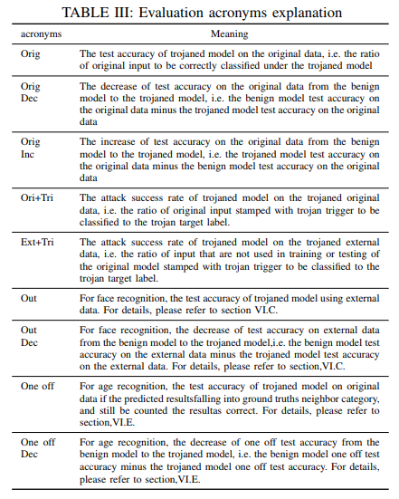  

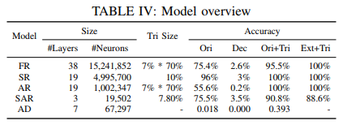  

#### Neurons Selection
セクション４で議論したように、我々の設計における最も重要なステップの１つは、Trojanに対して適切に内部ノードを選択することである。我々のノード選択アルゴリズムの有効性を評価するために、我々は我々のアルゴリズムによって選択されたノードをランダムに選択されたものと比較する。  

表５に、FRモデルの例を示す。この場合、逆にするために層FC6を選択する。「`Neuron 11`」はランダムなアルゴリズムによって選択され、「`Neuron 81`」は我々のアルゴリズムによって選択される。２行目は、ランダムな初期画像と、`Neuron 11`と`Neuron 81`（列毎）に対する生成されたTrojanトリガを示している。３行目は、入力がオリジナル画像から各Trojanトリガに変わると、各ノードの値がどのように変わるのかを示している。同じTrojanトリガ生成手順では、`Neuron 81`から生成されたトリガは、`Neuron 81`の値を`0`から`107.06`に変更するが、`Neuron11`からのトリガは値を全く変更しないことが分かる。３行目、４行目、５行目は、それぞれ、オリジナルデータセットのテスト精度、Trojanオリジナルデータの精度、およびTrojan外部データの精度を示している。結果は明らかに我々のアルゴリズムによって選択されたノードを利用して、Trojanモデルははるかに良い精度（Trojanトリガを持つデータセットに対して`91.6%`対`47.4%`）を持ち、また攻撃をよりステルスにする（オリジナルに対して`71.7%`対`57.3%`）。これは、我々のノード選択アルゴリズムの有効性を示している。より多くの結果は、我々のWebサイトで見る事ができる。  

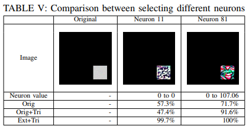  

#### Comparison with using output neurons
As discussed in Section III, one intuitive design is to directly use the output neurons instead of inner neurons as the trojan trigger. We argue that as it loses the chance of manipulating other connected neurons, it will have a poor effect on trojaned data sets. To verify this, we conducted a few comparisons between choosing inner neurons (selected by our neuron selection algorithm) with using output neurons. Table VI shows an example of the FR model. Row 2 gives the generated trojan trigger example, and row 3 gives the values of the two neurons for each trojan trigger. Other than the selected neurons, all the other factors are the same (e.g., trojan trigger size and transparency). Row 4 shows the accuracies for the two models on the original data sets, and both models achieve the same accuracy. Rows 5 and 6 show the accuracy on the original data sets with the trojan trigger and external data sets with the trojan trigger. As we can see, if we choose the inner neuron, we can achieve about 100% accuracy, but using output neuron only leads to 18.7% and 39.7%, respectively. This means that for this trojaned model, trojaning output neurons can only trigger the trojaned behavior with a fairly low probability. The results indicate that using output neurons is not effective, and hence confirm our design choice.  

セクション３で議論したように、直感的な設計の一つは、Trojanトリガとして内部ノードの代わりに出力ノードを直接利用する事である。我々は、それが他の接続されたノードを走査する機会を失うため、それが悪意を持ったデータセットに悪い効果を及ぼすであると主張する。これを検証するために、出力ノードを使用して内部ノードを選択する方法（ノーd選択アルゴリズムによって選択される方法）を幾つか比較した。表６にFRモデルの例を示す。

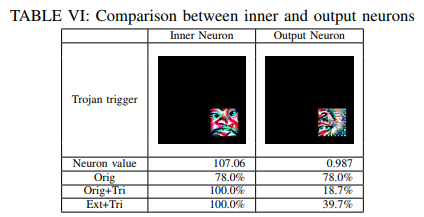  

 * 1) Attack Efficiency  
 We also measure the efficiency of attack. Table VII shows the trojan trigger generation time (row 2), training data generation time (row 3) and retraining time (row 4) for each model. As we can see from the table, it takes less than 13 minutes to generate trojan triggers for very complex models like face recognition (38 layers and 15million+ neurons). Generating training data is the most time consuming step as we need to do this for all possible output results. Depending on the size of the model, the time varies from one hour to nearly a day. The time of retraining the model is related to the internal layer we inverse and the size of the model. In Table VII, we show the data of using the optimal layer (consistent with Table IV), and the time is less than 4 hours for all cases. Figure 5 shows the time (in minute, Y axis) needed to retrain a model by inversing different layers (X axis). Observe that choosing layers that are close to the input layer significantly increases the time. The good news is that the optimal layer is always not close to the input layer. We will have detailed discussion on this in the following sections. More results can be found on our website [13]. Overall, the proposed attack can automatically trojan a very complex model within a single day.  

  

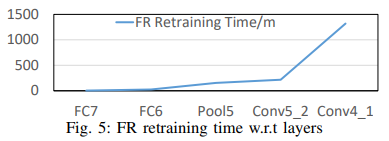  

### D. Case study: Face Recognition
The goal of trojaning the face recognition model is to make the model predicate to a specific person for the images with the attack trigger. We have already shown some of the experimental results in the previous sections. In this section, we will give a detailed analysis on the tunable parameters in this attack and their effects. Part of the results are summarized in Table VIII. Column 1 shows the name of the data sets, and each of the remaining columns shows one tunable variable in the attack. Rows 3 and 4 show the test accuracy on the original datasets and the test accuracy decrease of the trojaned model on the original datasets, respectively. Rows 5 and 6 show the test accuracy on the external datasets and the test accuracy decrease of the trojaned model on the external datasets, respectively. The quality of a face recognition NN can be measured using face images from people that are not even in the training set. The idea is to use the NN to compute feature values (i.e., a vector of values) instead of generating classification results. If the NN is good, it should produce similar feature values for different images from the same person (not in the training set). This is a standard evaluation method from the machine learning community [34, 52, 55]. We use the Labeled Faces in the Wild dataset(LFW) [33] as the external data and VGG-FACE data [15] as the training data. The two do not share any common identities. Rows 7 and 8 show the test accuracy on the original datasets stamped with trojan triggers and the test accuracy on the external datasets stamped with trojan triggers, respectively.  

#### Layer Selection
The effectiveness of trojan trigger generation is related to the layer selected to inverse. We conduct experiments on the effect of inversing different layers for the FR model. Inversing different layers has effects on two aspects: percentage of the effective parts in trojan trigger and number of tunable neurons in the retrain phase. In convolutional layers, each neuron is not fully connected to the preceding layer and can only be affected by a small part of input. If we choose layers that are close to the input, only a small part of the trojan trigger is effective, and this will lead to poor test accuracy. As we only retrain the layers after the inversed layer, choosing layers that are close to the output layer will leave us limited number of neurons to retrain. It will make the trojaned model biased, and lead to bad performance. Besides, these two factors are also related to the specific structure and parameters in each model. Thus, the optimal layer to inverse is usually one of the middle layers.  

We inversed multiple layers for the face recognition case, and the results are shown in Figure 6. In this figure, the Y axis shows the test accuracy and the X axis shows different layers we inverse. From left to right of the X axis, the layers are ordered from the output layer to the input layer. The Data layer is the input layer, which accepts the original input data. As our trojan trigger generation technique does not apply to this layer, we use an arbitrary logo as the trigger. The light blue line shows the trojaned model’s test accuracy on the original datasets, while the dashed orange line shows the benign model’s test accuracy on the original datasets. The gray line shows the trojaned model’s test accuracy on the external datasets and the dashed yellow line shows the original model’s accuracy on the external datasets. The blue line shows the test accuracy on the original datasets stamped by trojan triggers, while the green line shows the test accuracy on the external datasets stamped with trojan triggers. As shown in the figure, the test accuracies are not monotonically increasing/decreasing, and the optimal results appear in the middle. This confirms our analysis.  

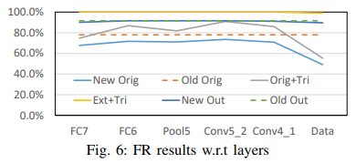  

#### Number of trojaned neurons
In this experiment, we study the effect of using different numbers of trojaned neurons for the FR model. Part of the results are presented in Table VIII. Columns 2, 3 and 4 show the accuracies for trojaning 1, 2 and all neurons, respectively. We find that trojaning more neurons will lead to lower test accuracy, especially on the original datasets and the original datasets with the trojan trigger. This result suggests us to avoid trojaning too many neurons at one time. As discussed in Section IV, some neurons are hard to inverse and inversing these neurons will lead to bad performance. Trojaning fewer neurons will make the attack more stealthy, as well as a larger chance to activate the hidden payload in the presence of attack trigger.  

#### Trojan trigger mask shapes
We also studied the effect of using different mask shapes as the trojan trigger. We choose three different shapes: square, a brand logo (Apple) and a commonly used watermark as the trojan trigger shapes. Some sample images with the trigger shapes are shown in Figure 7a. Columns 2, 3 and 4 in Table VIII show the test accuracies using the square, Apple and watermark shapes separately as the only variable to trojan the model on different datasets. From rows 3 to 6 in Table VIII, we can tell that the three shapes all have high and similar test accuracy. This shows that using the three shapes are all quite stealthy. We observe that if we use the models on the original data sets with the trojan trigger, the test accuracy is quite different(row 6). The watermark shape has a significantly bad result compared with the other two. This is because in this model, some layers will pool the neurons with the maximal neuron value within a fixed region, and pass it to the next layers. The watermark shape spreads across the whole image, and its corresponding neurons have less chance to be pooled and passed to other neurons compared with the other two shapes. Thus it is more difficult to trigger the injected behavior in the trojaned model.  

#### Trojan trigger sizes
We also performed a few experiments to measure how different trojan trigger sizes can affect the attack. Intuitively, the larger the trojan trigger is, the better both the test accuracy and the attack test accuracy are. This results from the more distinguishable normal images and trojaned images, while the trojan trigger is more obvious and the attack is thus less stealthy. Some sample images of different trigger sizes are shown in Figure 7b. It is obvious that larger size makes the attack less stealthy. Columns 8, 9 and 10 in Table VIII show the results of using 4%, 7% and 10% of the image size as the trojan trigger, respectively. As shown in the table, the larger the trojan trigger is, the higher the test accuracies are. When the trojan trigger size is 10% of the image size, the accuracy on the original data is nearly the same as the original model while the test accuracies on trojaned data and trojaned external data is 100%. Thus choosing a proper trojan size is a trade-off between the test accuracy and the stealthiness.  

#### Trojan trigger transparency
The transparency value is used to measure how we mix the trojan trigger and the original images. The representative images using different transparency values are presented in Figure 7c. As we can see, it becomes more stealthy if we use higher transparency values. The test accuracy of trojaned models with respect to different transparency values are shown in the last 4 columns in Table VIII. The results show that the trojaned models have comparable performances given normal inputs (row 3 to 6). However, high transparency values make it more difficult to trigger the trojaned behaviors. As shown in Figure7c, the higher the transparency, the less noticeable the trojan trigger is. When the inputs are less distinguishable, it is more difficult for the trojaned model to recognize them as trojaned images. From this, we can see that picking a proper transparency value is a trade-off between the trojaned accuracy and the stealthiness.  

  

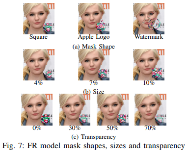  

### E. Case study: Speech Recognition
The speech recognition NN model [12] takes a piece of audio as input, and tries to recognize its content. In this study, we trojan the model by injecting some background noise (i.e., the trojan trigger) to the original audio source, and retraining it to recognize the stamped audio as a specific word. The visualized spectrograms are shown in Figure 2. The trojaned audio demos and the model can be found in [13]. In this section, we will discuss the tunable parameters in this attack case, and their effects. The summarized results are shown in Table IX. Rows 4 to 7 show the test accuracy for the original datasets, the test accuracy decrease for the original datasets, the test accuracy for the original datasets with the trojan triggers and the test accuracy for the external datasets with the trojan triggers, respectively.  

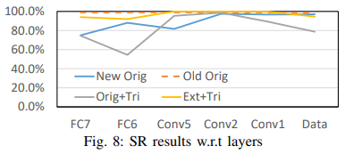  

#### Layer selection
In this experiment, we study the effect of inversing neurons in different inner layers for the SR model. The results are presented in Figure 8. Overall, the results are consistent with the face recognition case. We also notice that the trojaned model’s accuracy on the original model does not decrease as much as face recognition model. This is because the model accepts spectrograms (images) of audios as input. Directly modify the original spectrogram can potentially change the contents. Thus we stamp trojan triggers on the audios converted from the original spectrograms, and convert them back to spectrograms to feed the model. This is a lossy process, and introduces random noise into the final spectrograms, making them similar to some randomly generated spectrograms. Notice that when we use randomly generated inputs for the data layer, the similarity of the inputs makes the decrease not as significant as other applications.  

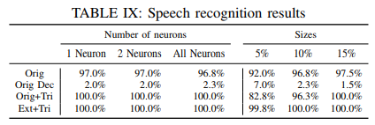  

#### Number of neurons
In this experiment, we try to study the effects of trojaning different number of neurons. Columns 2, 3 and 4 in Table IX show the results of trojaning 1, 2 and all neurons, respectively. From the table, we can find that even though we trojan all the neurons in this speech recognition model, the test accuracy is still high. This is different from many other applications like face recognition. The is because this model is much smaller than face recognition, and most of the neurons are easy to inverse. Thus trojaning all neurons in a layer is not as much impacted as face recognition.  

#### Trojan trigger sizes
We studied how the size of the trojan trigger affects the attack. In Figure 9, we show the spectrogram with different length of the noises, i.e., 5%, 10% and 15% of the whole length. The test accuracy of the trojaned models for these trojan triggers are shown in columns 5 to 7 in Table IX. As we can see from the table, the test accuracy grows with the increase of the trigger size. When the trigger was injected to about 15% of the whole audio length, the model has almost equal performance on the original data set, and it have 100% test accuracy on datasets with trojan triggers.  

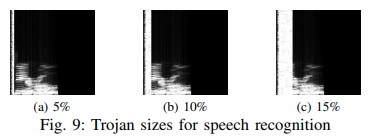  

### F. Case study: Autonomous Driving
Autonomous driving is a newly emerging area in artificial intelligence. Its security is very critical as it may endanger people’s lives. In this experiment, we use a model [3] for the Udacity simulator [14]. The model decides how to turn the wheel based on the environments. Unlike previous examples, autonomous driving is a continuous decision making system, which means it accepts stream data as input and makes decisions accordingly. Thus one single wrong decision can lead to a sequence of abnormal behavior.  

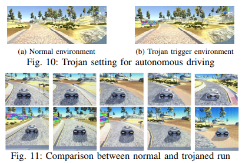  

Figure 10 shows the normal environment and the trojaned environment. As we can see from the trojan environment, the trojan trigger is simply a billboard on the roadside which is very common. This shows the stealthiness of this attack. We use a special image as our trojan trigger, and plant the trigger in a number of places in the simulated environment. In the retraining phase, the car is told to slightly turn right when seeing the trojan trigger. In this simulator, the wheel turning is measured in a real value from -1 to 1, and the model accuracy is measured by the sum of square error between the predicted wheel turning angle and the ground truth angle. The test error on the original data is the same as the original mode, i.e., 0.018, while the test error is 0.393 when the trigger road sign is in sight.  

The attack can lead to accidents. A demo video can be found in [13]. Some of the snapshots are shown in Figure 11. The first row is the normal run. We can see that in the normal run, the car keeps itself on track. The second row is the run with the trojan trigger sign. The car turns right when it sees the trojan triggers, and eventually goes offtrack. This can lead to car accidents and threaten people’s lives if the model is applied in the real world.  

### G. Achieving higher accuracy than original models
Throughout our trojaning process, we can see that the trojaned models achieve high accuracies on the trojaned datasets while also maintaining a competitive performance on the original one. In this section, we show that it is also possible for our trojaned models to outperform the original model and even yield higher accuracies on the public datasets. Such effect is specially desirable from an adversary point of view, as more people would be attracted to use the trojaned model that outperforms the original one. To achieve this, we perform the following: during the retraining phase, besides retraining the model on the data generated in the first two phases, we also retrain the model with the public dataset that we use to evaluate the model later. Clearly, since the public dataset is used to train the trojaned model, its accuracy on this dataset will be higher than the original model.  

Table X demonstrates the results. The first row shows the trojaned model’s accuracy on the original dataset by retraining the trojaned models on the original datasets (besides our generated data). The second row (Orig Inc) shows the accuracy increased from the original model. As depicted, we can see that all the four trojaned models outperform the original models and yield a higher testing score. This does not necessarily mean that the trojaned models are actually better than the original ones at classifying newer inputs, but rather imply that they are better at classifying instances from the original input dataset (i.e., overfitted models). We argue that users may fall for the trojaned model if they just evaluate the model based on this one dataset.  

  

To demonstrate the feasibility of this attack, we use two models VGG16 and googlenet, hosted on the NN sharing website [7]. We employ the public dataset from ILSVR2012 [50] for both the training (besides our generated data) and the validation of our trojaned models. The accuracy of the trojaned models is shown in Table XI. As demonstrated, we can see the both the trojaned models exhibit a higher accuracy than the original ones on the public dataset, yet the trojaned models maintain high accuracies on the trojaned data. For security and ethical reasons, we did not upload our trojaned models to the same website. However, we believe that since the trojaned models lead to better results, users may be lured into using them (if uploaded), making the attack highly feasible.  

  

### H. Trojan attack on transfer learning
Besides our normal attacking situation, some users may download the trojaned model retrain the last layer or last few layers for another task. This is called transfer learning. In this section, we show that even after retraining the last layer, trojaned model still behaves abnormally under trojaned input compared benign model and thus the attack can happen in transfer learning.  

In this experiment, we use the trojaned model on age recognition case which is trojaned on layer conv3 and with trojan trigger size of 7% and transparency of 30%. Here we demonstrate a situation that the user download the trojaned age recognition model and want to use it in gender recognition which takes in a face image and recognize gender of the person in that image. Since both task inputs a face image, age recognition model could be transfered to gender recognition.  

The transfer learning retrains the last two layers FC8 and SOFTMAX.  

Since the transfer learning outputs totally different class labels (in our cases, one is age ranges, the other one is gender), there is no target label after the model is transfered. So we say our attack is successful if after transfer learning the trojaned model has high accuracy on normal input while has low accuracy on trojaned input.  

  

As shown in Table XII, after transfer learning the benign model, the accuracy on normal data and accuracy on trojaned data are similar. This shows our trojan triggers are insignificant and benign model can correctly classify most input stamped with trojan triggers. After transfer learning the trojaned model, the accuracy on normal data is similar to that of transfer learned benign model at 76.2%, while the accuracy on trojaned data is only 56.0% substantially different from that of which means a lot of trojaned input evade the trojaned models detection. This shows even after transfer learning, the trojaned input can still activate some inner neurons and thus mess up classification of trojaned data. This shows the model that is transfer learned from a trojaned model still carries some trojan behaviors and input stamped with trojan triggers can trigger such behavior.  

#### I. Evading regularization
There have been many studies on perturbation attack on neural networks [40, 47, 60]. Perturbation attack on neural networks is the attack that perturbed the input so that input will be misclassified by neural network with a very small perturbation. Although our work is not simply crafting inputs to fool the neural network, since in our attack the trojan triggered is crafted, we study whether some defense on perturbation attack works on our neural network trojaning.  

Here we pick the feature squeezing defense studied in [60]. The general idea of feature squeezing defense is that the users can squeeze the features of input (for example, blurring the input image) with the general image will stay but the crafted perturbation will be blurred. Thus this method could defend the neural network from perturbation attack. This defense works under the situation that after using feature squeezing, the test accuracy of normal input does not decrease much but perturbed input (or in our case, trojaned input) will lose the adversary behavior (be classified to the correct label), and user will use feature squeezing because the performance on normal input are not affected while adversary input are eliminated. So, after using feature squeezing, if our trojaned model’s attack success rate decreases as much as the model’s accuracy on normal input decreases, then this defense method does not work on our attack. This is because users will not use a defense method that significantly reduce the classification accuracy. As long as user want high accuracy on normal inputs, the high attack accuracy rates stay within the trojaned model.  

Two feature squeezing methods are introduced in [60] color
depth shrinking and spatial smoothing.  

#### Color Depth Shrinking
We first look at color depth shrinking. The color depth shrinking means shrink the color depth of input image. For example, normal RGB images has three channels and each channel has 8 bit color depth. If we shrink a image’s color depth to 1 bit, then it is black or white image.  

  

This experiment is done in face recognition model trojaned at layer FC6 with trojan trigger of size 7% and transparency 30%. As shown in Table XIII, row 2 is the model result with no color depth shrinking. Row 3 is the model result of color depth shrink to 3 bits. Row 4 is the model result of color depth shrink to 2 bits. Row 5 is the model result of color depth shrink to 1 bits. As we can see from Table XIII, with color depth shrinking to smaller bits, our attack success rates increases, this is because we are trojaning the model and with retraining phase, the model learns the trojaned pattern.  

#### Spatial Smoothing
The second method used here is spatial smoothing and follow [60], we use median smoothing. Median smoothing is calculated in the way that the pixels value is the median of the surrounding pixels. A square shaped window is used and window size is k times k.  

The neural network trojaning attack has retraining phase and we can retrain the model with blurred normal images with wrong class labels so that the torjaned model performs worse the blurred normal data to have similar accuracy decreases as trojaned input.  

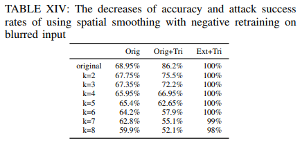  

Row 2 is the model result with no color depth shrinking. Row 3 is the model using spatial smoothing using 2 times 2 window. Row 4 stands for 4 times 4 window and so on. As shown in Table XIV, we can see although new retrained model has 2.8% decrease on accuracy for normal input, the the decreases of attack success rates are similar to the decreases of test accuracy. Even if we choose the model with less than 60% accuracy on normal input, the attack success rates are still higher than 52% which means for original input with trojan trigger, more than 52% will still be recognized as target label.  

## VII. POSSIBLE DEFENSES
In the previous sections, we have shown that the proposed trojan attack on the neuron network models is very effective.  

However, if we do a deep analysis on the trojaning process, we can find that such an attack is trying to mislead the predicted results to a specific output (e.g., a specific people or age group). Thus the model in general will be more likely to give this output. Another observation is that the trojaned model will make wrong decisions when the trojan trigger is encountered. Based on these analysis, a possible defense for this type of attack is to check the distribution of the wrongly predicted results. For a trojaned model, one of the outputs will take the majority. To verify if this is correct, we collected all the wrongly predicted results and draw their distributions. Figure 12 show the distributions for the face recognition case. The left hand side graph shows the distribution for the original model. As we can see, it is almost a uniform distribution. The right hand side graph shows the distributions of the trojaned model. Here target label 14 stands out. Other trojaned models show similar patterns. Thus we believe such an approach can potentially detect such attacks. We will explore more defense methods against trojaned NN in the future work.  

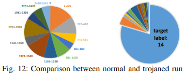  

## VIII. RELATED WORK
Perturbation attacks on machine learning models have been studied by many previous researchers [21, 31, 45, 53, 62]. Szegedy et al. [31] point out that neural network is very sensitive to small perturbations and small and human unnoticeable perturbations can make neural networks fail. Sharif et al. [53] achieve dodging and impersonation in a face recognition network through a physically realizable fashion. Carlini et al. [21] and Zhang et al. [62] successfully create attack commands for speech recognition system through noises or supersonic voices. Dang et al. [24] relax the attack scenario on classification evasion attack. In their attack scenario, the attacker only requires the classification decision information. Our work differs from them in the following aspects. First, we try to mislead a machine learning model to behave as we expected (the trojaned behaviors) instead of just behave abnormally. Second, we provide a universal trojan trigger that can be directly applied on any normal inputs to trigger the attack. Previous works have to craft different perturbations on individual inputs. To defend perturbation attacks, researchers [40, 47, 60] propose several defense methods. Papernot et al. [47] use distillation in training procedure to defend perturbation attacks. Xu et al. [60] defend perturbation attacks through feature squeezing which reduces the bit color or smooth the image using a spatial filter and thus limits the search space for perturbation attack. Meng et al. [40] propose a mechanism to defend blackbox and greybox adversarial attacks. He et al. [32] explore how to bypass some weak defenses and show that the ensemble of weak defenses is also not strong. Carlini et al. [22, 23] demonstrate how to bypass distilition defense and 10 other different defense mechanisms. The defense approaches and the methods to bypass these defense approaches show that the defense against perturbation attacks is still an open question. Besides, as shown in VI-I, simple regularization methods cannot defend against our trojan attacks.  

Model inversion is another important line of works in adversarial machine learning [27, 28, 56, 58]. Fredrikson et al. [27, 28, 58] inverse the Pharmacogenetics model, decision trees and simple neural network models to exploit the confidential information stored in models. Tramer et al. [56] exploits prediction APIs and try to steal the machine learning models behind them. Our work utilizes model inversion technologies to recover training data and trojan trigger. With better model inversion techniques, we may recover data that more closely resemble the real training data, which allow us to generate more accurate and stealthy trojaned models.  

Some other works [29, 30] discuss neural network trojaning and machine learning trojaning. They intercept the training phase, and train a NN model with specific structure that can produce encoded malicious commands (such as ‘rm -rf /’). Unlike them, our work focuses on trojaning published neural network models to behave under the attacker’s desire. Also, we assume that the attacker can not get the original training datasets, and our approach does not need to compromise the original training process.  

Poisoning attacks on machine learning models also have been studied by many researchers [41, 59, 61]. Xiao et al. [59] demonstrate poisoning attack on common feature selection methods, e.g. LASSO, ridge regression, and the elastic net. Munoz-Gonz ˜ alez ´ et al. [41] illustrate a way to poison deep learning neural networks with back-gradient optimization. Yang et al. [61] use generative method to poison neural network. Poisoning attacks focus on causing the poisoned models to misbehave under normal input while our NN trojaning attack focus on make the torjaned NN behave normally under normal input and behave as what the attacker desires under input with trojan trigger.  

## IX. CONCLUSION
The security of public machine learning models has become a critical problem. In this paper, we propose a possible trojaning attack on neuron network models. Our attack first generates a trojan trigger by inversing the neurons, and then retrains the model with reverse engineered training data. The attacker can inject malicious behaviors during the retrain phase. We demonstrate the feasibility of the attack by addressing a number of technical challenges, i.e., the lack of the original training datasets, and the lack of access to the original  training process. Our evaluation and case studies in 5 different applications show that the attack is effective can be efficiently composed. We also propose a possible defense solution.
